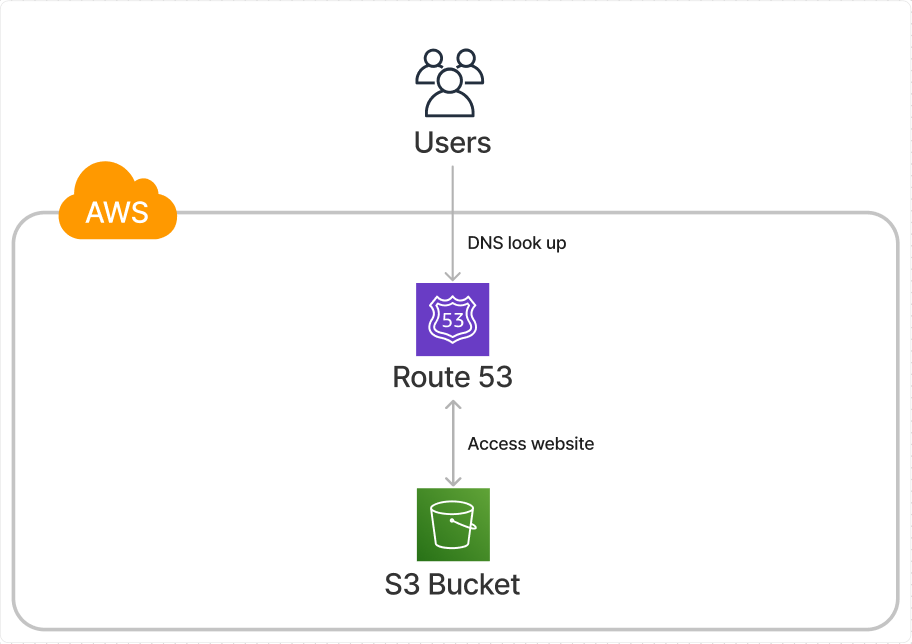

# resume_portfolio_site

---

## Table of Contents

- [resume\_portfolio\_site](#resume_portfolio_site)
  - [Table of Contents](#table-of-contents)
  - [Description](#description)
  - [How To Use](#how-to-use)
  - [Technologies](#technologies)
  - [Architecture](#architecture)
  - [Collaborators](#collaborators)

---

## Description
- My responsive static website showcasing my resume and portfolio
- Built for broswer and mobile
- Deployed over AWS
- Read more about my project on my [blog](https://wnbui.dev/posts/static_site/)

---

## How To Use

- Access the website [here](http://wnbui.com)

---

## Technologies

- HMTL
- CSS
- AWS S3
- AWS Route53

---

## Architecture

---

## Collaborators

- Will Bui - [GitHub](https://github.com/wnbui)

---

[Back To The Top](#resume_portfolio_site)
